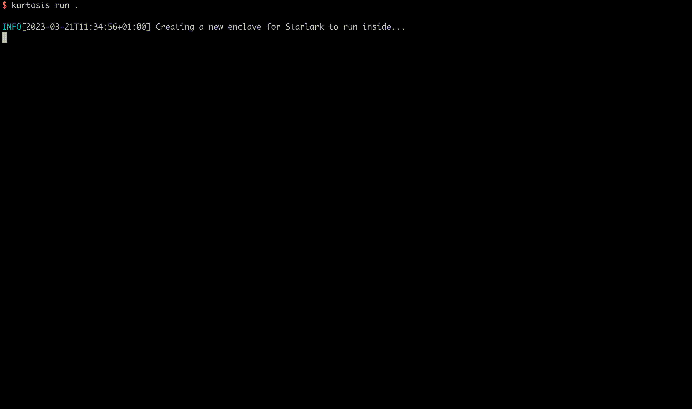

## Redis Package



This is a [Kurtosis Starlark Package](https://docs.kurtosis.com/starlark-reference) that allows you to spin up a Redis instance.

### Run

This assumes you have the [Kurtosis CLI](https://docs.kurtosis.com/cli) installed

Simply run

```bash
kurtosis run github.com/kurtosis-tech/redis-package
```

### Using this in your own package

Kurtosis Packages can be used within other Kurtosis Packages, through what we call composition internally. Assuming you want to spin up Redis and your own service
together you just need to do the following

```py
main_redis_module = import_module("github.com/kurtosis-tech/redis-package/main.star")

# main.star of your Cassandra + Service package
def run(plan, args):
    plan.print("Spinning up the Redis Package")
    # this will spin up Redis and return the output of the Redis package
    redis_run_output = main_redis_module.run(plan, args)
```
